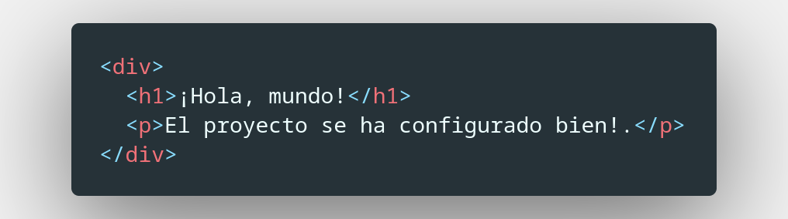

# Eagle Wear

Aplicación web de comercio electrónico construida con Angular para la tienda de ropa Eagle Wear. Diseñada para ofrecer una experiencia de compra en línea intuitiva y personalizada.

## Proceso de Desarrollo

### Creación del repositorio en GitHub

Para comenzar, creamos un nuevo repositorio en GitHub. Este repositorio servirá como nuestro espacio de trabajo en la nube y nos permitirá versionar nuestro código y colaborar con otros desarrolladores.


### Clonación del Repositorio Localmente

Una vez creado el repositorio en GitHub, se procedió a clonarlo en el entorno de desarrollo local.    
Esto se realizó utilizando la línea de comandos y el comando `git clone`.  

```bash
git clone git@github.com:Ebriopes/sps-web-shop-daniel-vargas.git
```


### Inicialización del Proyecto con Angular CLI

Con el objetivo de acelerar el desarrollo y contar con una estructura de proyecto preconfigurada, se utilizó Angular CLI para inicializar el proyecto.

```bash
ng new eagle-wear --directory eagle-wear
```


### Limpieza del Contenido Inicial

Para personalizar el proyecto y eliminar los componentes y archivos que no son necesarios para el desarrollo de la aplicación, se procedió a eliminar el contenido generado por defecto por Angular CLI.    

Esto permitió comenzar con un proyecto limpio y adaptado a las necesidades específicas.

Se elimina el contenido de `src/app/app.component.html`

| Antes | Después |
| ----- | ------- |
| )|  |

### Verificación inicial del proyecto

Para verificar que el proyecto se haya configurado correctamente y que los cambios se reflejen en el navegador, se agregó un mensaje de texto simple.  

Este mensaje servirá como un marcador visual para confirmar que la configuración inicial fue correcta.



#### Levantamiento del Proyecto

A continuación, se inició el servidor de desarrollo de Angular utilizando el comando `ng serve`.  

Permitiendo visualizar los cambios realizados en tiempo real en el navegador.


Al acceder a la dirección indicada en la consola (http://localhost:4200), se pudo confirmar que el mensaje agregado se muestra correctamente en el navegador.


!Con esto hemos inicializado el proyecto!  

### Creación de un nuevo componente: Vista de Login

Para dar inicio al desarrollo de la funcionalidad de autenticación, se creó un nuevo componente llamado "Login".  

Este componente será el encargado de mostrar el formulario de inicio de sesión y gestionar la interacción del usuario con el mismo.  

```bash
ng generate component --standalone views/login
```


Angular CLI generó automáticamente los archivos necesarios para el componente, incluyendo el componente en sí, el archivo de estilos y la plantilla HTML.

#### Enrutamiento del Login

Para hacer que la vista de Login sea accesible a través de la URL, es necesario configurarlo en el enrutamiento de la aplicación. Para ello modificamos el archivo de rutas (`app-routing.module.ts`) y en el componente principal de la aplicación (`app.component.html`), se agrega la directiva `<router-outlet>`.


#### Crear la vista de Login

Antes de maquetar el Login, primero debemos instalar algunas herramientas.

##### Instalación de Angular Material y Bootstrap

Para mejorar la apariencia y la experiencia del usuario en la vista de Login, se decidió utilizar los frameworks de diseño Angular Material y Bootstrap. Estos frameworks proporcionan componentes prediseñados y estilos CSS que facilitan la creación de interfaces de usuario atractivas y consistentes.

###### Instalación de Angular Material

Se utilizó Angular CLI para instalar Angular Material:

```bash
ng add @angular/material
```


###### Instalación de Bootstrap
Para complementar Angular Material y agregar más opciones de estilo, se instaló Bootstrap:

```Bash
npm install bootstrap
```


Posteriormente, se agregó la siguiente línea al archivo `angular.json` para incluir los estilos de Bootstrap en el proyecto:

```json
"styles": [
  "./node_modules/bootstrap/dist/css/bootstrap.min.css",
  "@angular/material/prebuilt-themes/deeppurple-amber.css",
  "src/styles.scss"
]
```

##### Maquetado del Componente de Login

Con Angular Material y Bootstrap instalados, se procedió a maquetar el componente de Login.  
Se utilizaron los componentes de Angular Material para crear los elementos del formulario (campos de texto, botones, etc.) y se aplicaron estilos de Bootstrap para personalizar la apariencia.  


Dando como resultado


#### Servicio de autenticación
Para manejar los accesos y la información de nuestros usuarios se creó un servicio encargado de administrar este proceso. Para ello nos basamos en el patrón de diseño Observer.

Se creó el servicio *authentication* con el siguiente comando:

```bash
ng generate service services/authentication --interactive
```


También se crearon las interfaces para la autenticación:

```bash
ng generate interface common/models/user.model
ng generate interface common/models/credentials.model
```


Basado en la documentación de Fake Store API para [registrar](https://fakestoreapi.com/docs#u-update) y [loguear](https://fakestoreapi.com/docs#a-login) un usuario, se crearon 2 interfaces que nos sirven para conocer la estructura de información a enviar y recibir.  


---

## Recursos

* <https://v16.angular.io/>  
* <https://gitmoji.dev/>  

## Tecnologías

* Angular (v16)
* TypeScript
* Angular Material
* Bootstrap
